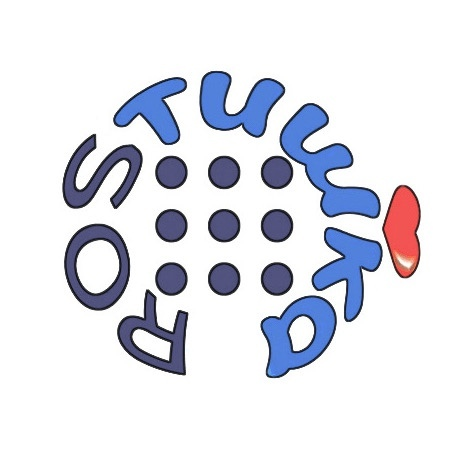

ROSтишка тим для НТИ УГ 

#  ROSтишка team для НТИ УГ 



Веб-интерфейс + скрипты управляющие симуляцией.

## Порядок установки:

* ```git clone https://github.com/SailorTheMan/rostishka_UG.git ```
* Удалить папку .venv
* Из корня репозитория запустить ```python3 -m venv .venv```
* Активировать venv ```. .venv/Scripts/Activate.ps1```
* Перейти в папку src
* Запустить ```pip install -r 'requirements.txt'```
    * Если у вас выключено исполнение скриптов, пройти шаги отсюда https://ru.stackoverflow.com/questions/935212/powershell-%D0%B2%D1%8B%D0%BF%D0%BE%D0%BB%D0%BD%D0%B5%D0%BD%D0%B8%D0%B5-%D1%81%D1%86%D0%B5%D0%BD%D0%B0%D1%80%D0%B8%D0%B5%D0%B2-%D0%BE%D1%82%D0%BA%D0%BB%D1%8E%D1%87%D0%B5%D0%BD%D0%BE-%D0%B2-%D1%8D%D1%82%D0%BE%D0%B9-%D1%81%D0%B8%D1%81%D1%82%D0%B5%D0%BC%D0%B5
* Включить веб сервер в симуляции факторио ```app.web_server = True```

## Запуск веб-интерфейса:
* Создать админа: ```python manage.py createsuperuser```
* Из папки src выполнить: ```python manage.py runserver```

## Запуск скрипта, управляющего симуляцией

* Открыть новыю вкладку терминала и из корня репозитория ```python warehouse_program.py```

